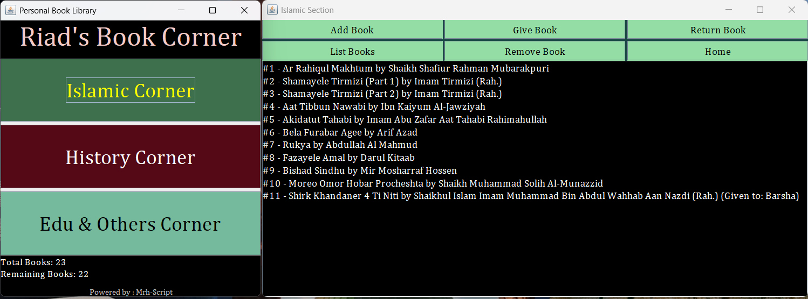

# 📚 Personal Book Library

## 📝 Summary

**Personal Book Library** is a user-friendly and colorful book management system built using **Java Swing**.  
It allows you to manage your books in categorized sections like *Islamic*, *History*, and *Others*.  
You can add, give, return, remove books, and view your collection with unique serial numbers.  
The data is saved automatically and persists between runs.

---

## ⭐ Features

- 📖 Manage books by section: *Islamic*, *History*, *Others*  
- ➕ Add books with name and writer  
- 📤 Give books to someone (with tracking)  
- 🔄 Return books back to library  
- ❌ Remove books permanently  
- 📋 List all books with serial numbers  
- 📂 Save and load library data automatically  
- 🖥️ Simple, intuitive GUI using **Java Swing**  
- 🎨 Colorful layout and Cambria fonts for elegant look  
- 🏠 Home navigation with a warm welcome message  
- 💾 Persistent data using serialization  

---

## 🛠️ Technology Used

- Java (JDK 8 or higher)  
- Java Swing for GUI  
- Object Serialization for saving/loading  
- Custom fonts, layout managers, and color palette  
- IDE: IntelliJ IDEA or NetBeans  

---

## 🖼️ Interface

*(You can insert your screenshots here)*  
Example:  
  
 

---

## 👤 Author

**Md. Riad Hasan**  
BSCSE Student  
**Uttara University, Bangladesh**
